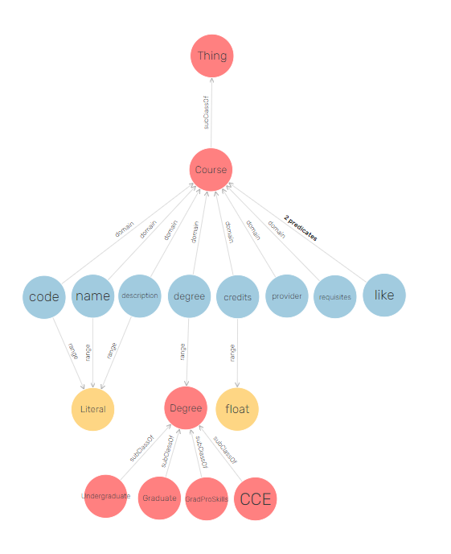
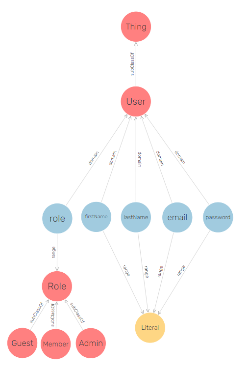
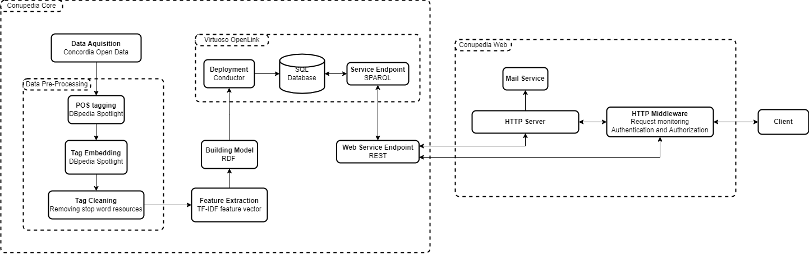
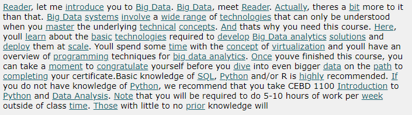
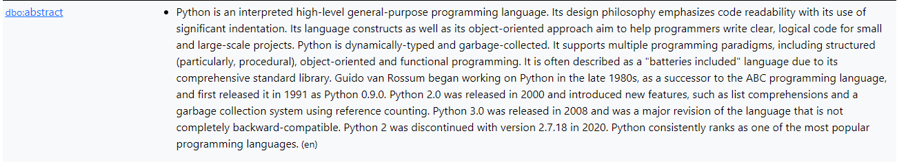
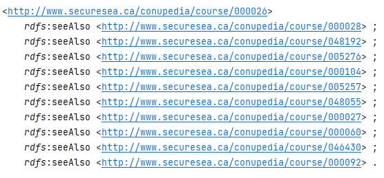
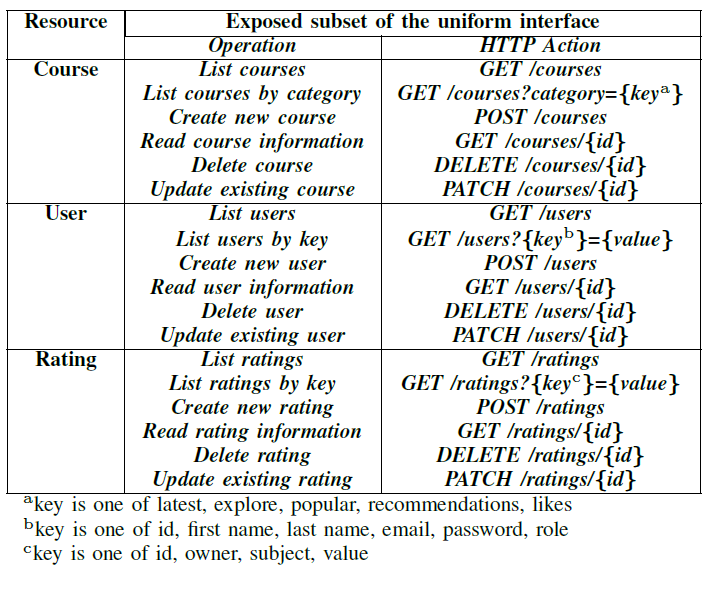
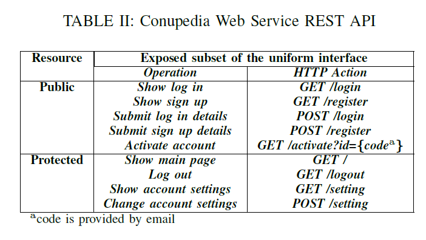
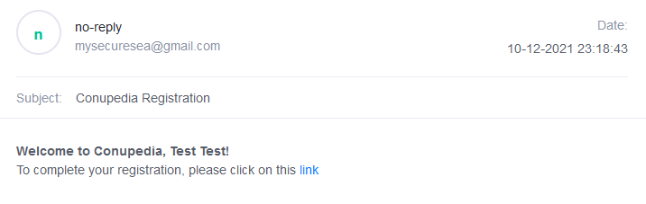
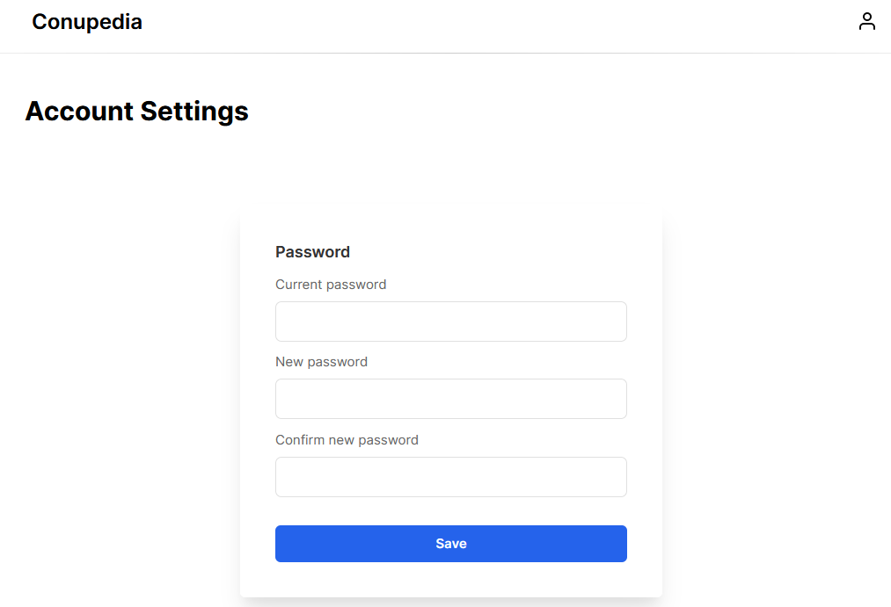

# Dependencies

- python-multipart
- requests
- fastapi
- starlette
- uvicorn[standard]
- pip3
- python3
- lxml

# Overview
Conupedia is a software suite that resides on the cloud as
a service [1]. Once a user registers on the platform, they can
interact with courses. Conupedia maintains data about user
interactions and provides personalized recommendations based
on previously given feedback. In this section, we propose
a resource description framework (RDF) modeling approach
for capturing information related to users, courses, and the
interactions that are expected to occur within the Conupedia
environment.

## Course

A Course element defines a course offered at an Institute
(see Fig. 1). An instance of a Course has a code, name, degree,
provider, and a credit attribute. Optional attributes, such as a
description and requisites, may be provided as well.

In general, the code defines the department associated with
an instance of a Course, as well as an identifier that is rep-
resented as a number. In Fig. 2, the code ACTU445 signifies
that this Course is found in the Department of Mathematics
and Statistics and has been given a number of 256.
The name of a Course is equivalent to its title and is
represented as a string. In Fig. 2, the name of this course
is Mathematics of Finance.

The description attribute is an overview of a certain Course,
including the related concepts covered. In Fig. 2, the descrip-
tion is found below the title. This attribute is optional as certain
courses do not have descriptions tied to them.

The degree defines the level of education that an instance
of a Course belongs to. Not every course is limited to the
undergraduate and/or graduate level. Some courses are also
offered in more than one degree. For this reason, the degree
attribute is not restricted to being a primitive type.

The credits attribute defines the number of credits, rep-
resented as a floating point value, of a Course. It may be
that some courses offer no credits. This is generally found in
courses offered in a workshop.
The provider of a Course corresponds to the Institute that
offers the course.

The requisites attribute defines enrolment requirements on
a Course. A course may be a pre-requisite or a co-requisite
of some other course. As well, special permission by the
department may be required to take a course. These details
have been captured in Conupedia, but not displayed. The
reasoning behind this is that requisite expressions are written
in the natural language, and are varied in their expressions.
Advanced processing techniques are required to form these
types of relations.

Finally, the seeAlso attribute defines the similarity relation
between one course and another. A similarity relation is
established based on the description of a Course.

## User

The User element defines the actors registered to the
Conupedia system (see Fig. 3). An instance of this class
contain attributes related to the person it belongs to, which
includes, but is not limited to, their first and last names, email,
password, and role.

While the email attribute is used during the registration
process to verify if an account already exists, and is used
as part of the login field, we do not impose limitations on
changing it at a later time. In fact, a different unique identifier
is generated for every created instance of User. This identifier
is used as part of the IRI that identifies a specific User, and
is mentioned in the identifier property.

## Rating

User-course interactions are defined using the Rating ele-
ment (see Fig. 4). Every instance of a Rating has an owner,
subject, and value attributes. The subject and owner of a
Rating points to the referable instances of a Course and a User
respectively, while the value defines the opinion expressed by
the owner on the subject.

A user can express an opinion for some course. We assume
that opinions are not influenced by other factors beyond
reading of the title or description of any course. Using this
assumption, we identify two main cases for user-course inter-
actions. First, a user can express interest in some course. In
Conupedia, this opinion is represented using the like button. A
user may also express dis-interest in some course. This opinion
is represented using the dislike button. The assumption is that
when users express interest in a course, they expect to receive
content similar to that course. Similarly, when they express
dis-interest in a course, then the expectation is that courses
similar to the targeted course should not be displayed in the
future.

# Conupedia

Conupedia consists of two applications: Conupedia Core,
and Conupedia Web. We distinguish the two applications
by their functionalities, the cloud technology used, and the
targeted audience (see Fig. 5). In this section, we elaborate on
the proposed design, and the reasoning behind the distinction.

## Conupedia Core
Conupedia Core is a software for storing course related
data remotely using cloud technologies. It is a SaaS that
provides users with a web-based platform for uploading and
maintaining course information without the hassles involved
in maintaining a database. Conupedia Core offers a number
of features, such as the ability to track opinions expressed
by users on courses, sorting of courses based on certain
parameters (i.e popularity), and information pertaining to
a given course (i.e degree level requirements). Users also
benefit from the use of the built-in encryption techniques (i.e
RS256) and hashing techniques (i.e SHA256) for securely
storing customer information. Conupedia Core is hosted on
AWS for availability and scalability purposes. The underlying
architecture consists of 2 main components: a database
management, and web service endpoint. However, for
demonstration purposes and as a proof of concept, we include
3 other components: data acquisition, data pre-processing,
and feature extraction.
### Data Aquisition
Open Data is a technology that
collects information on various topics at Concordia University
and transforms them into a machine-readable format [2].
The information stored in Open Data is accessible via the
application programming interface (API). Conupedia relies
on this information to generate courses, along with their
descriptions, codes, titles, and level of education. The issue
with Open Data, however, is that the information supplied
is raw, with no context attached. This means, data can be
interpreted in a variety of ways, negatively impacting the
results of Conupedia’s recommendation engine. The data
therefore needs to be pre-processed before being modelled.
### Data Pre-Processing

A course description is an overview of the concepts related to a course. Terminologies
found in descriptions can be abstract and/or specific and
technical. The level of expressiveness in a description is
generally proportional to its size. Course descriptions are also
written in the natural language, and as such, there is an implicit
assumption that the reader can extract context from these
descriptions. In the data pre-processing stage, these concerns
are addressed by proposing an approach to automating and
enriching the tagging process of course descriptions.

The current solution relies on the use of an existing service
called DBpedia Spotlight [3]. With this service, tags are
extracted from natural language expressions by mapping them
with existing resources found in the DBpedia data store. Since
the same resource can be used in various domains and its
interpretation depends on the context within which it is used in,
DBpedia Spotlight attempts to solve this problem by scoring
each candidate resource according to its relatedness with the
data provided. The extraction and relevancy of a resource is
dependent on the user setting the confidence level appropriate
to their use case.

In Conupedia, we use a confidence level of 0.35 to extract
resources as it was observed to output the most relevant
resources for descriptions containing abstract and specific ter-
minologies. However, there still remained the issue of course
descriptions that contained specific terminologies, and those
that were abstract and small in size. For example, consider a
course containing a specific resource for Python, and another
for Programming Language. This presents an issue when
forming relations between the two courses as one of the
resources is a specific instance of the other. There is also the
problem of a course having few resources tied to it (i.e small
or abstract), thus presenting a challenge when links are formed
between it and other courses.

Abstract information related to the outputs of DBpedia
Spotlight are also taken into consideration in the Conupedia
system (see Fig. 7). These pieces of information are fed back
into DBpedia Spotlight as input and the outputs are used to
enrich the set of resources tied to a course. Thresholds are
used to constraint the number of resources bound to courses,
and the maximum depth allowable while extracting resources.

With a confidence level of 0.35, undesirable resources
can be extracted from course descriptions. For example, the
This resource does not participate in describing concepts
of a course. Conupedia eliminates these types of resources
by referring to the corpus of common English stop words
in the sklearn module [6]. The remaining resources bound
to courses are converted to tags and used in the feature
extraction stage.

In Fig. 8, an instance of a Course is linked to other Courses
based on the top 10 highest match rates. These references are
queried when producing a list of recommendations. We note
that not all courses in the list are displayed as it depends on
whether or not the user has previously seen them.

### Feature Extraction
To generate a match rate for all courses, we considered the tags belonging to every course.
These tags were fitted onto a term frequency-inverse document
frequency feature matrix using sklearn. The motivation behind
using a TF-IDF feature matrix is to reduce the weight of terms
that were common in all descriptions, while increasing the
weight of those that were specific to some courses. The match
rate was computed using the cosine similarity of the TF-IDF
matrix.

n Fig. 8, an instance of a Course is linked to other Courses
based on the top 10 highest match rates. These references are
queried when producing a list of recommendations. We note
that not all courses in the list are displayed as it depends on
whether or not the user has previously seen them.

### Database Management
In Conupedia, the knowledge base is stored and managed by the Virtuoso OpenLink
database manager. Administration tasks, such as importing
and exporting the data store, are performed using the
Conductor plugin. Data in store can be queried and modified
via Virtuoso’s built-in SPARQL endpoint.

### Web Service Endpoint
While the SPARQL endpoint allows for REST calls to be made to it, we determined that
having a REST API specific to the use cases studied in
Conupedia was more appropriate for operating the database
system. In this way, the technicalities for manipulating data
can be abstracted and make it so that it is friendly for the user
making the calls.

The capabilities of the Conupedia Core software includes
the ability to create, modify, and query Users, Courses,
and Ratings (see Table I). Here, the intention is that users
can implement their own flavors of course-recommendation
systems without having to re-configure the back-end system
or incur limitations in storage and computing.

## Conupedia Web

Conupedia Web is a web application that makes it easy for
end-users to explore various courses offered by an Institute.
Users who sign-up to the website can interact with courses
and acquire recommendations based on their interactions.
Conupedia Web is dependant on Conupedia Core and its
features to provide various functionalities in a user-friendly
way. It is defined as a flavor of a course-recommendation
system for Concordia University, and can be hosted using
any PaaS provider. For the purposes of this demonstration
and as proof of concept, we present two main components
of Conupedia Web: an HTTP middleware, and an HTTP server.

### HTTP Middleware

The HTTP middleware component of Conupedia Web intercepts all incoming requests from the
web server endpoint and verifies their authenticity. A request
is authentic if information contained in the session cookie can
be decrypted and mapped to an existing user. When a user
logs in to Conupedia, their information is encrypted using a
private key and sent back to the user using the set-cookie http
header. Throughout a given session, the information stored in
the cookie is used to determine if it belongs to a valid user. In
the case where it is valid, the HTTP middleware component
forwards the request to the main HTTP server, where it is
further processed. The response from the HTTP server is then
forwarded back to the user. However, if a request is not valid,
the client is requested to remove the cookie and is redirected
to the login page.

### HTTP Server

The HTTP server component processes incoming requests from the HTTP middleware. It’s primary
purpose is to handle several types of requests by referring to
information stored in Conupedia Core.

API calls are classified into two categories: public, and
protected (see Table II). Protected calls cannot be accessed
without authentication. This is granted when the user sends a
valid POST request in the log in page.

Anyone can sign up by filling out their details in the register
page. When the form is submitted, the server verifies the email
address of the user against an existing entry in the database
system. If the provisioned email address already exists, the
user needs to supply another address. Otherwise, the account
is created and an activation message is sent via email (see Fig.
9).

When a user logs in to Conupedia, they are directed to the
Explore section within the root directory. The user is presented
with a list of courses. An interaction from a user involves
either liking or disliking a certain course. This is achieved by
hovering over a course, and selecting the appropriate reaction
(see Fig. 10).

A user can also visit other categories. To date, Conupedia
supports the display of courses in the recommendations, latest,
likes, and popular categories (see Fig. 11).

Finally, a user can access the settings page, where they can
request for a new password (see Fig. 12). The server verifies
the current password of a user by matching it with the related
entry in the database system. If a match is found, the password
is updated.

Indeed, the main purpose of the web server in Conupedia
is to present information supplied by the database system in a
human-friendly manner by hiding the underlying technicalities
involved in communication. The server also monitors for ill-
formed, or invalid requests on resources by preventing them
from reaching the database system.

# Conclusion
Persistent modifications of entries within the course cal-
endar at Concordia University necessitates students to consult
these changes and to adapt their existing scheduling plan when
a conflict occurs. Conflicts may also not be detected until
a student is given access to the enrolment cart during the
registration period. For this reason, we propose Conupedia.
This system adapts to changes in the availability of courses
in an autonomous manner and provides users with course
recommendations that are personalized to their interest and
requirements.
