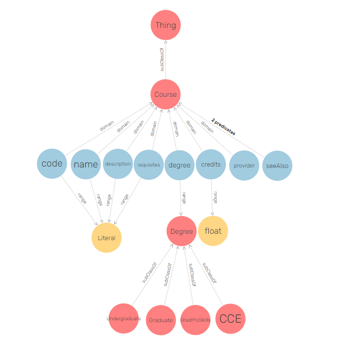
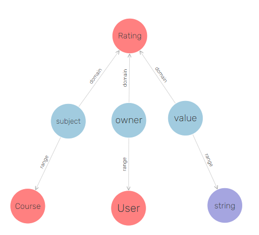

# Conupedia

Currently, in development...

# Dependencies

- python-multipart
- requests
- fastapi
- starlette
- uvicorn[standard]
- pip3
- python3
- lxml

sudo ss -lptn 'sport = :80'

# Model

## Course

A _Course_ element defines a course offered at a University.
In the context of Conupedia, the range of courses is limited to the ones offered at Concordia University.
An instance of a _Course_ has a _code_, _name_, _degree_, _provider_, and a _credit_ attribute.
Optional attributes, such as a _description_ and _requisites_, may be supplied as well.

The following Figure is a visual representation of _Course_ instance:

The _code_ usually consists of the department and number associated with a _Course_.
In Figure [X], the code _ACTU445_ signifies that this _Course_ is found in the Department of Mathematics and Statistics and has been given a number of 256. 

The _name_ of a Course is equivalent to its title and is represented as a string.
In Figure [X], the name of this course is _Mathematics of Finance_.

The _description_ attribute contains information about concepts and details that a _Course_ covers.
In Figure [X], the description is found below the title.
This attribute is optional as certain courses do not have descriptions tied to them.

The _degree_ of a _Course_ defines the level of education that a course belongs to.
Not every course is limited to the Undergraduate and/or Graduate level.
Some courses are also offered in more than one degree.
For this reason, a degree expression is not limited to containing one value.

The _credits_ attribute defines the number of credits, as a floating point value, of a _Course_.
It may be that some courses offer no credits.
This is generally found in courses offered by some workshop.

The _provider_ of a Course corresponds to the institute that offers the course. 

The _requisites_ attribute defines the constraints applicable for a course.
A course may be a pre-requisite or a co-requisite of some other course.
As well, special permission by the department may be required to take a course.
These details have been captured in Conupedia, but not displayed.
The reasoning for this is that requisite expressions are written in the natural language, and are varied.
Advanced processing techniques would have been required to form these relations.

Finally, the _like_ attribute defines the similarity relation between one course and another.
Similarity is measured based on the _description_ of a _Course_.
Section [x] elaborates on the type of algorithms involved in establishing a similarity relation.

## User

The _User_ element is used to describe actors registered to the Conupedia system.
An instance of this class contain attributes related to the person it belongs to, which includes, but is not limited to, their first and last name, email, password, and role.

 
While the _email_ attribute is used during the registration process to verify if an account already exists, and is used as part of the login field, we do not impose limitations on changing it at a later time.
In fact, a different unique identifier is generated for every created instance of _User_. 
This identifier is used as part of the URI for the _User_, and is mentioned in the _identifier_ property.

## Rating

A user can express an opinion for some course.
Without additional factors affecting the formulation of an opinion, we assume that opinions originate from consultations of the title or description of a given course.
Using this assumption, we identify two main cases for user-course interactions.

A user can express interest in some course.
In Conupedia, this opinion is represented using the _like_ button.

A user may also express dis-interest in a some course.
This opinion is represented using the _dislike_ button.

The assumption is that when users express interest in a course, they expect to receive content similar to that course.
For example, when _SCPA315_ is liked, then content similar to it should be displayed as a recommendation. 
Similarly, when they express dis-interest in a course, then the expectation is that courses similar to the targeted course should not be displayed in the future.

User-course expressions are stored using the _Rating_ element.
Every instance of a _Rating_ has an _owner_, _subject_, and _value_ attribute.
The _subject_ and _owner_ of a _Rating_ refers to the referable instances of a _Course_ and a _User_ respectively, while the _value_ refers to the opinion expressed by the _owner_ on the _subject_. 

